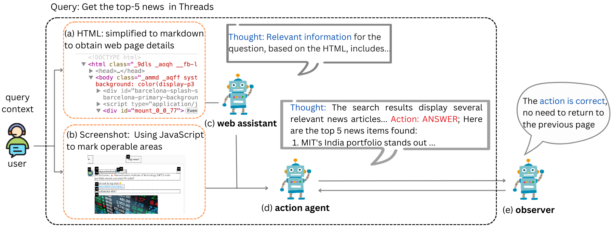

<div align="center">
<h1> PagePilot
<br> Multimodal Web Assistant based on Natural Language </h1>
</div>

<div align="center">


</div>




PagePilot integrates visual input and web source code as the foundation of automated control and includes improvements like dynamic loading. It achieved task completion rates of 76\% and 47\% on the WebVoyager and GAIA datasets, respectively, surpassing the baseline set by WebVoyager and GPT-4, while significantly reducing the number of actions required. Our framework enhances task completion rates by 22\% while reducing action steps by 27\%, setting a new benchmark for automated web control.

# how to run
```
python run.py \
    --test_file data/run.jsonl \
    --headless \
    --max_iter 15 \
    --max_attached_imgs 3 \
    --temperature 1 \
    --fix_box_color \
    --seed 42 \
    --web_markdown \
    --web_assistant \
    --dynamic_load \
    --web_observer \
    --api_key OPENAI_API_KEY \
    --api_model gpt-4o
```
* for AOAI
```
--api_key AOAI_API_KEY \
--api_base AOAI_API_BASE \
--api_type azure \
--api_version AOAI_API_VERSION \
--api_model AOAI_API_MODEL
```
* for OpenAI compatible models (OpenRouter)
```
--api_key API_KEY \
--api_base API_BASE \
--api_model API_MODEL
```

# Evaluation
```
python evaluation/auto_eval_dump.py \
    --api_key OPENAI_API_KEY \
    --process_dir DIR \
    --max_attached_imgs 15 \
    --api_model gpt-4-turbo
```

                